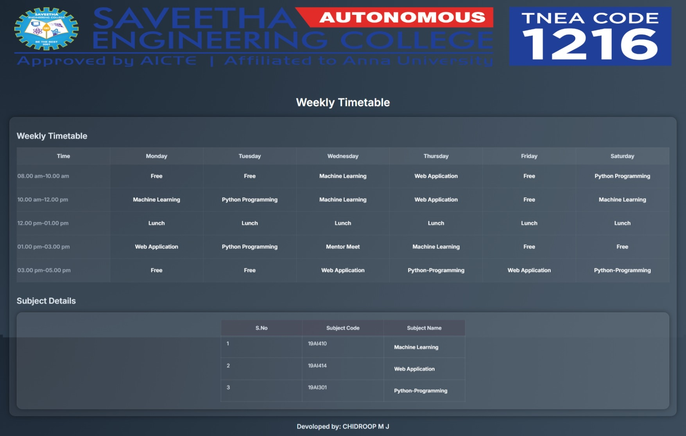

# Ex03 Time Table
## Date:03/10/2025
## Devoloped by: CHIDROOP M J
## Reference Number: 25018548
## AIM
To write a html webpage page to display your slot timetable.

## ALGORITHM
### STEP 1
Create a Django-admin Interface.

### STEP 2
Create a static folder and inert HTML code.

### STEP 3
Create a simple table using ```<table>``` tag in html.

### STEP 4
Add header row using ```<th>``` tag.

### STEP 5
Add your timetable using ```<td>``` tag.

### STEP 6
Execute the program using runserver command.

## PROGRAM
```html

<!DOCTYPE html>
<html lang="en">
<head>
  <meta charset="UTF-8" />
  <meta name="viewport" content="width=device-width, initial-scale=1" />
  <title>Semester Timetable</title>
  <link href="https://fonts.googleapis.com/css2?family=Inter:wght@400;600&display=swap" rel="stylesheet">
  <style>
    :root {
  --bg: radial-gradient(circle at top left, #1c2734, #2f3e4d, #3f4f5f);
  --panel: rgba(255, 255, 255, 0.07);
  --text: #e0e8f0;
  --muted: #a0aab8;
  --border: rgba(255, 255, 255, 0.06);

  /* Softer neon subject colors 
  --c-free: #95a5a6;
  --c-machine-learning: #4dd0e1;
  --c-web-application: #81c784;
  --c-python-programming: #ffb74d;
  --c-mentor-meet: #f06292;
  --c-lunch: #bdbdbd;*/
}

html, body {
  height: 100%;
  background: var(--bg);
  color: var(--text);
  font-family: "Inter", system-ui, -apple-system, Segoe UI, Roboto, Arial, sans-serif;
}

.page {
  display: flex;
  flex-direction: column;
  align-items: center;
  margin: 48px auto;
  padding: 0 20px;
}

h1 {
  font-size: 32px;
  font-weight: 700;
  margin-bottom: 24px;
  color: #ffffff;
  text-shadow: 0 0 4px rgba(255,255,255,0.15);
}

.table-wrap {
  background: var(--panel);
  border-radius: 16px;
  padding: 20px;
  backdrop-filter: blur(10px);
  box-shadow: 0 0 16px rgba(0,0,0,0.4);
  border: 1px solid var(--border);
  overflow: auto;
}

.timetable {
  width: 100%;
  border-collapse: collapse;
  min-width: 720px;
  table-layout: fixed;
}

.timetable caption {
  text-align: left;
  font-weight: 600;
  color: var(--muted);
  padding-bottom: 10px;
}

.timetable thead th {
  background: rgba(255,255,255,0.08);
  color: var(--text);
  text-align: center;
  font-weight: 600;
  padding: 14px 16px;
  border: 1px solid var(--border);
  text-shadow: 0 0 3px rgba(255,255,255,0.1);
}

.timetable th[scope="row"] {
  background: rgba(255,255,255,0.06);
  color: var(--muted);
  font-weight: 600;
  width: 180px;
  border: 1px solid var(--border);
  text-align: left;
}

.timetable td {
  padding: 14px 16px;
  border: 1px solid var(--border);
  vertical-align: top;
  text-align: center;
  background: rgba(255,255,255,0.03);
  transition: background 0.3s ease;
}

.timetable tbody tr:hover td {
  background: rgba(255,255,255,0.06);
}

.subject {
  display: inline-block;
  margin: 4px 2px;
  padding: 6px 12px;
  border-radius: 999px;
  font-weight: 600;
  color: #fff;
  text-align: center;
  white-space: nowrap;
  box-shadow: 0 0 6px rgba(136, 134, 134, 0.08);
  transition: transform 0.2s ease, box-shadow 0.2s ease;
}

.subject:hover {
  transform: scale(1.04);
  box-shadow: 0 0 10px rgba(255,255,255,0.15);
}

/* Subject-specific colors */
.subject.free { background: var(--c-free); }
.subject.machine-learning { background: var(--c-machine-learning); }
.subject.web-application { background: var(--c-web-application); }
.subject.python-programming { background: var(--c-python-programming); }
.subject.mentor-meet { background: var(--c-mentor-meet); }
.subject.lunch { background: var(--c-lunch); }

@media (max-width: 720px) {
  h1 { font-size: 24px; }
  .timetable td, .timetable th { padding: 10px 12px; }
  .subject { padding: 5px 10px; font-size: 14px; }
}
  </style>
</head>
<body>
<center>

</center>
  <main class="page">
    <h1>Weekly Timetable</h1>

    <div class="table-wrap" role="region" aria-labelledby="caption" tabindex="0">
      <table class="timetable">
        <h2>Weekly Timetable</h2>
        <thead>
          <tr>
            <th scope="col">Time</th>
            <th scope="col">Monday</th>
            <th scope="col">Tuesday</th>
            <th scope="col">Wednesday</th>
            <th scope="col">Thursday</th>
            <th scope="col">Friday</th>
            <th scope="col">Saturday</th>
          </tr>
        </thead>
        <tbody>
          <tr>
            <th scope="row">08.00 am–10.00 am</th>
            <td><span class="subject free">Free</span></td>
            <td><span class="subject free">Free</span></td>
            <td><span class="subject machine-learning">Machine Learning</span></td>
            <td><span class="subject web-application">Web Application</span></td>
            <td><span class="subject free">Free</span></td>
            <td><span class="subject python-programming">Python Programming</span></td>
          </tr>
          <tr>
            <th scope="row">10.00 am–12.00 pm</th>
            <td><span class="subject machine-learning">Machine Learning</span></td>
            <td><span class="subject python-programming">Python Programming</span></td>
            <td><span class="subject machine-learning">Machine Learning</span></td>
            <td><span class="subject web-application">Web Application</span></td>
            <td><span class="subject free">Free</span></td>
            <td><span class="subject machine-learning">Machine Learning</span></td>
          </tr>
          <tr>
            <th scope="row">12.00 pm–01.00 pm</th>
            <td><span class="subject lunch">Lunch</span></td>
            <td><span class="subject lunch">Lunch</span></td>
            <td><span class="subject lunch">Lunch</span></td>
            <td><span class="subject lunch">Lunch</span></td>
            <td><span class="subject lunch">Lunch</span></td>
            <td><span class="subject lunch">Lunch</span></td>
          </tr>
          <tr>
            <th scope="row">01.00 pm–03.00 pm</th>
            <td><span class="subject web-application">Web Application</span></td>
            <td><span class="subject python-programming">Python Programming</span></td>
            <td><span class="subject mentor-meet">Mentor Meet</span></td>
            <td><span class="subject machine-learning">Machine Learning</span></td>
            <td><span class="subject free">Free</span></td>
            <td><span class="subject free">Free</span></td>
          </tr>
          <tr>
            <th scope="row">03.00 pm–05.00 pm</th>
            <td><span class="subject free">Free</span></td>
            <td><span class="subject free">Free</span></td>
            <td><span class="subject web-application">Web Application</span></td>
            <td><span class="subject python-programming">Python-Programming</span></td>
            <td><span class="subject web-application">Web Application</span></td>
            <td><span class="subject python-programming">Python-Programming</span></td>
          </tr>
        </tbody>
      </table>
    <style>
    .small-table {
       font-size: 15px;
       max-width: 60px;
       margin: 0 auto;
       border-collapse: collapse;
    }
    .small-table td,
    .small-table th {
       padding: 12px 16px;
       text-align: left;
       border: 3px solid var(--border);
       background: rgba(152, 157, 200, 0);
    }

    .small-table thead th {
       background: rgba(74, 70, 85, 0.475);
       color: var(--text);
       text-shadow: 0 0 3px rgba(80, 67, 67, 0.1);
    }
  </style>
    <h2 style="margin-top: 40px;">Subject Details</h2>
<div class="table-wrap">
  <table class="timetable small-table">
    <thead>
      <tr>
        <th>S.No</th>
        <th>Subject Code</th>
        <th>Subject Name</th>
      </tr>
    </thead>
    <tbody>
      <tr>
        <td>1</td>
        <td>19AI410</td>
        <td><span class="subject machine-learning">Machine Learning</span></td>
      </tr>
      <tr>
        <td>2</td>
        <td>19AI414</td>
        <td><span class="subject web-application">Web Application</span></td>
      </tr>
      <tr>
        <td>3</td>
        <td>19AI301</td>
        <td><span class="subject python-programming">Python-Programming</span></td>
      </tr>
    </tbody>
  </table>
</div>
    </div>
    <h3 align="left">Devoloped by: CHIDROOP M J</h3>
</body>
</html>

```

## OUTPUT


## RESULT
The program for creating slot timetable using basic HTML tags is executed successfully.
